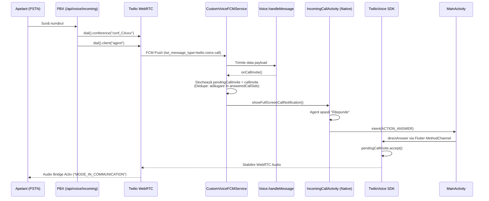
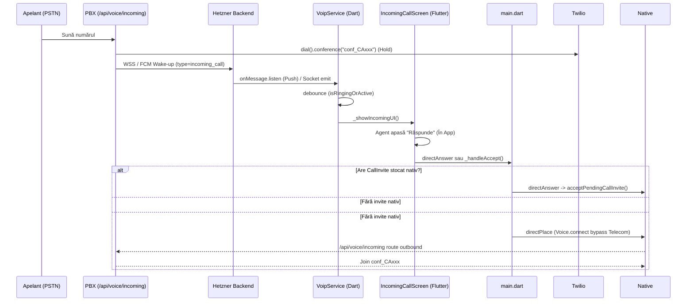

# Android VoIP Call Flow: Firebase FCM vs Supabase/Hetzner Wake-up

Acest document descrie flow-ul cap-coadă al unui apel de intrare (incoming call) pe platforma Android, evidențiind de ce în anumite scenarii pot apărea "două UI-uri" suprapuse (una de la Twilio SDK via FCM, și a doua via Flutter/WebSocket) și cum sunt aplicate regulile de deduplicare curente.

## Tabel Comparativ: Surse de Declanșare UI

| Sursă (Source)      | Payload Type                          | Procesator (Handling Layer)                                                                                                         | UI Declanșat (UI Triggered)                                                                      |
| :------------------ | :------------------------------------ | :---------------------------------------------------------------------------------------------------------------------------------- | :----------------------------------------------------------------------------------------------- |
| **Twilio FCM**      | `twi_message_type=twilio.voice.call`  | Android Native: `CustomVoiceFirebaseMessagingService` → `Voice.handleMessage()` → `onCallInvite()`                                  | Full-screen Notification → `IncomingCallActivity.kt` (Native Android UI)                         |
| **Hetzner Wake-up** | `type=incoming_call` (via FCM sau WS) | Android Native (+Flutter): `CustomVoiceFirebaseMessagingService` → Forward broadcast sau Flutter `VoipService.handleIncomingData()` | Full-screen Notification (Hetzner fallback) sau ecranul intern Flutter `IncomingCallScreen.dart` |

> **Problema Curentă (Dublu Flow):** Când un apel este pus pe hold în PBX, acesta declanșează simultan un invite WebRTC prin rețeaua Twilio (`twi_message_type`) și un push custom din backend spre aplicația Flutter (`type=incoming_call`). Această "cursă" declanșează două sisteme de rendering vizual independente dacă deduplicarea eșuează.

---

## Diagrame de Secvență (Mermaid)

### 1. Flow-ul Nativ: PSTN → Twilio FCM → `directAnswer`

Acesta este fluxul nativ, robust, care folosește obiectul intern `CallInvite` procesat de Android (optimizat pentru a ocoli crash-urile Telecom pe Huawei/Honor).

### 2. Flow-ul Fallback: Hetzner Wake-up → Flutter UI → `call.place`

Acesta este fluxul care prinde cazurile în care token-ul Twilio a expirat (sau device-ul respinge FCM-urile de tip `twilio.voice`), bazându-se pe un TCP fallback bridge (`call.place`).

---

## Reguli de Deduplicare Actuale

Pentru a preveni apelarea și afișarea multiplă, sistemul actual folosește un strat hibrid de flag-uri:

1. **`answeredCallSids` (Android Native Set):**
   - **Unde:** `CustomVoiceFirebaseMessagingService.kt`
   - **Cum:** Un Set în memorie în care se memorează ID-ul apelurilor (`callSid`) care au declanșat o apăsare de Answer.
   - **Scop:** Când se lansează `showFullScreenCallNotification`, dacă `callSid` este în listă, notificarea este refuzată pe loc. Astfel, apăsarea Răspunde în Flutter nu duce la afișarea lock screen-ului dacă Twilio întârzie livrarea push-ului nativ.

2. **`autoAnswerUntil` (Android Race Condition Timer):**
   - **Unde:** `MainActivity.kt` & `CustomVoiceFirebaseMessagingService.kt`
   - **Cum:** Un timestamp TTL (System.currentTimeMillis + 15 secunde). Când Răspunde este apăsat _înainte_ de primirea CallInvite-ului, acest timestamp este generat.
   - **Scop:** Dacă WebRTC C++ întârzie cu 2-3 secunde livrarea `CallInvite`-ului, sistemul știe că apelul este deja dorit de utilizator și injectează nativ `callInvite.accept()` în blocul `onCallInvite` ignorând UI-ul cu totul.

3. **`VoipService.isRingingOrActive` (Flutter Singleton Debouncer):**
   - **Unde:** `voip_service.dart`
   - **Scop:** Blochează execuția rutei `type=incoming_call` (Wake-up fallback) dacă aplicația a încărcat deja widget-ul roșu din Flutter sau dacă se află deja într-un apel PJSIP activ.

---

## Referințe Fisiere

Implementarea prezentată rezidă în:

- **Android:**
  - `app/src/main/java/.../services/CustomVoiceFirebaseMessagingService.kt`
  - `app/src/main/java/.../ui/IncomingCallActivity.kt`
  - `app/src/main/kotlin/.../MainActivity.kt`
- **Flutter:**
  - `lib/services/voip_service.dart`
  - `lib/screens/incoming_call_screen.dart`
  - `lib/main.dart`
- **Server:**
  - `server/voice-service/index.js` (Blocul `app.post('/api/voice/incoming')`)
